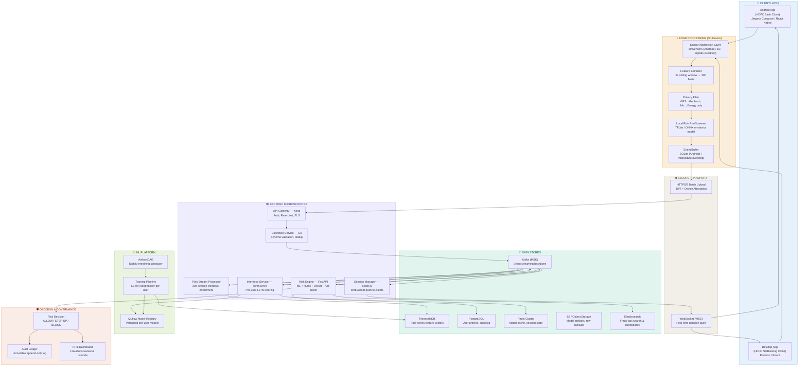
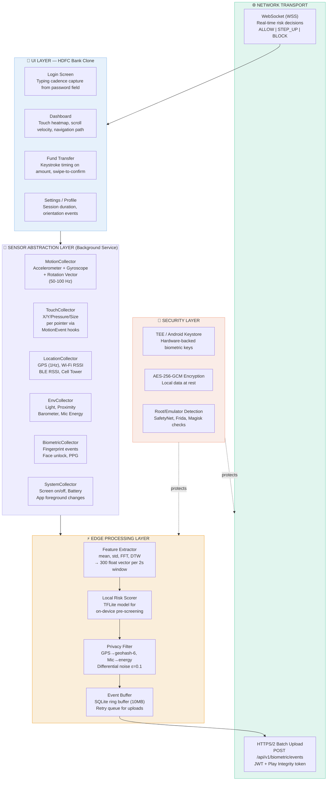
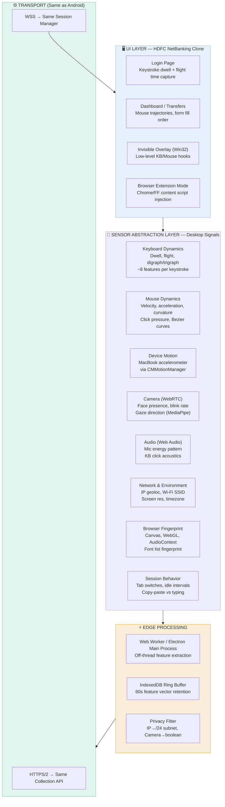
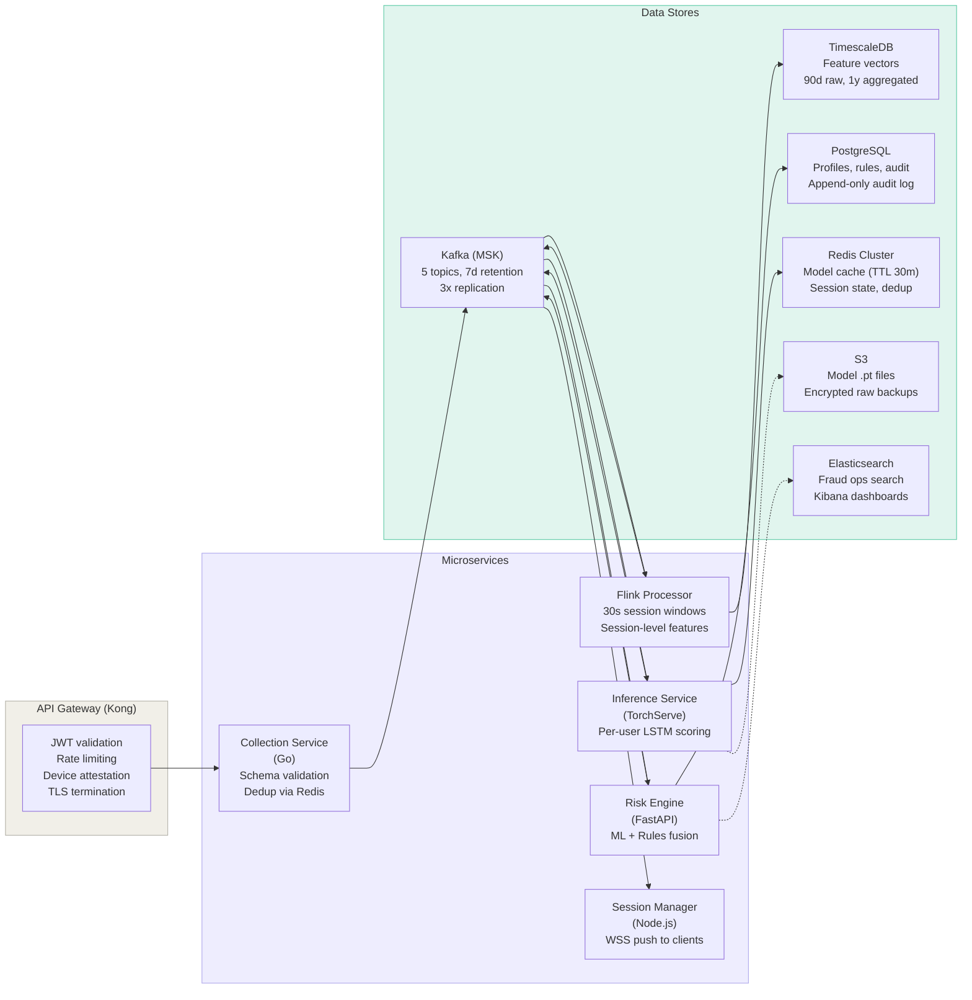
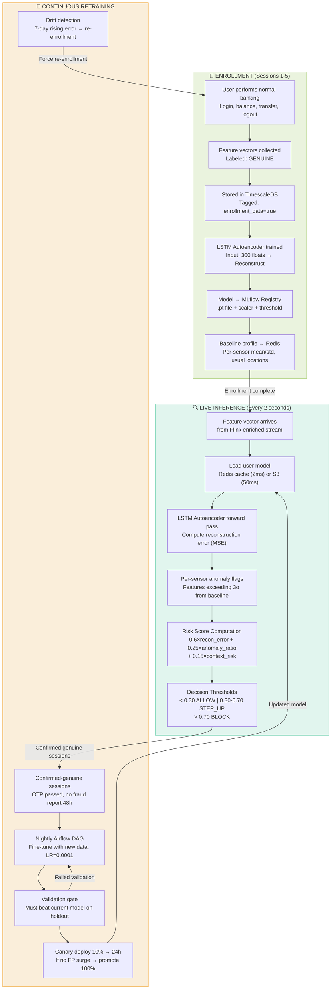
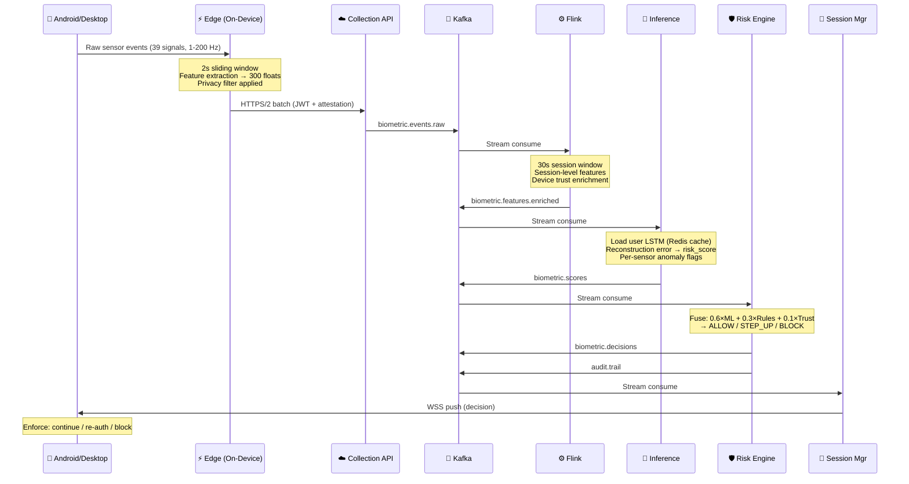

# Banking-APP-Behavioural-Biometrics

# 🏦 Behavioural Biometrics — System Architecture & Implementation Plan

> **Project**: Continuous Authentication via Behavioural Biometrics for Banking  
> **Base App**: HDFC Bank Clone (Android + Desktop)  
> **Core Idea**: Capture 39 sensor signals from the user's device during banking sessions, train a per-user behavioural model, and score every session in real-time to detect impostors.

---
## 🚀 Live Preview

> • [🎨 System Design ⚡ - Live Demo ](https://system-design-behavioural-biometrics.edgeone.app/) •
 
> • [🎨 Architecture ⚡ - Live Demo ](https://krithiikaa.github.io/Banking-APP-Behavioural-Biometrics/) •

> • [🎨 Mobile UI Design ⚡ - Live Demo ](https://stitch.withgoogle.com/preview/10837085091759448495?node-id=9fba777b8baf453395c5302f181209c6) •

> • [🎨 Desktop UI Design ⚡ - Live Demo ](https://stitch.withgoogle.com/preview/5980981783955325194?node-id=1cc9328b12a441349fd81d3c5f37d7cb) •

---

## 1. High-Level System Design Diagram

---

## 2. Android App Architecture (HDFC Bank Clone + 39 Sensors)

### The 39 Sensors (Android)

| # | Category | Sensors | Hz | Features Extracted |
|---|----------|---------|----|--------------------|
| 1-3 | **Motion** | Accelerometer (X,Y,Z) | 100 | Mean, std, FFT peaks, jerk |
| 4-6 | **Motion** | Gyroscope (X,Y,Z) | 100 | Angular velocity, tilt pattern |
| 7-9 | **Motion** | Rotation Vector (X,Y,Z) | 50 | Device orientation signature |
| 10 | **Motion** | Step Counter | 1 | Gait pattern during phone use |
| 11-14 | **Touch** | X, Y, Pressure, Size | Event | Touch heatmap, swipe shape (DTW) |
| 15-16 | **Touch** | Velocity X, Velocity Y | Event | Swipe speed signature |
| 17-18 | **Touch** | Touch area, Pointer count | Event | Grip pattern, multi-touch habits |
| 19 | **Location** | GPS lat/lon | 1 | Usual locations (geohash) |
| 20-21 | **Location** | Wi-Fi RSSI, SSID | 0.03 | Known networks proximity |
| 22-23 | **Location** | BLE RSSI, Cell Tower ID | 0.1 | Indoor location context |
| 24 | **Environment** | Ambient Light | 5 | Indoor/outdoor, time-of-day |
| 25 | **Environment** | Proximity | 5 | Phone-to-face distance |
| 26 | **Environment** | Barometer | 1 | Floor level, altitude |
| 27 | **Environment** | Mic Energy Level | 10 | Background noise fingerprint |
| 28-29 | **Biometric** | Fingerprint pass/fail, Face unlock | Event | Auth method preference |
| 30 | **Biometric** | PPG / Heart Rate | 1 | Stress level during transactions |
| 31-33 | **Keyboard** | Dwell time, Flight time, Error rate | Event | Typing rhythm signature |
| 34-35 | **System** | Screen on/off, App foreground | Event | Usage pattern |
| 36 | **System** | Battery level + charging | 0.1 | Charging habits |
| 37 | **System** | Device orientation | Event | Portrait/landscape preference |
| 38 | **Network** | Connection type (WiFi/LTE) | 0.1 | Network behavior |
| 39 | **Temporal** | Time-of-day + day-of-week | Per-session | Usage schedule fingerprint |

---

## 3. Desktop App Architecture (HDFC NetBanking Clone)

### Desktop vs Android — Key Differences

| Aspect | Android (39 sensors) | Desktop (15+ signals) |
|--------|---------------------|-----------------------|
| **Motion** | Accel, Gyro, Rotation (hardware) | Only MacBook/Surface (limited) |
| **Location** | GPS, BLE, Cell Tower, Wi-Fi | IP Geolocation only (~city) |
| **Touch** | Full multitouch with pressure | Mouse only (richer trajectory) |
| **Keyboard** | ~5-10 features (touchscreen) | ~50-80 features (physical keys) |
| **Biometrics** | Fingerprint, Face, PPG | Windows Hello / Touch ID (opaque) |
| **Strongest Signal** | Motion + Touch + Location | Keyboard + Mouse dynamics |
| **Edge Runtime** | TFLite + SQLite | Web Worker + IndexedDB |

---

## 4. Backend Microservices & Storage Architecture

### Kafka Topics

| Topic | Producer | Consumer | Purpose |
|-------|----------|----------|---------|
| `biometric.events.raw` | Collection Service | Flink | Raw feature vectors from devices |
| `biometric.features.enriched` | Flink | Inference Service | Session-level enriched features |
| `biometric.scores` | Inference Service | Risk Engine | ML risk scores + anomaly flags |
| `biometric.decisions` | Risk Engine | Session Manager | ALLOW / STEP_UP / BLOCK |
| `audit.trail` | Risk Engine | Elasticsearch | Immutable audit events |

---

## 5. ML Training & Prediction Pipeline

### Risk Score → Decision Matrix

| Score Range | Decision | Action |
|-------------|----------|--------|
| **0.00 – 0.30** | ✅ ALLOW | Transparent. No user interruption. Logged to audit. |
| **0.30 – 0.55** | 🟡 SOFT FLAG | Log only. Visible to fraud ops. Used for retraining. |
| **0.55 – 0.70** | 🟠 STEP-UP AUTH | Silent biometric re-auth → if fail, OTP to mobile. |
| **0.70 – 0.85** | 🔴 HIGH-RISK STEP-UP | Biometric + OTP. Maker-checker for transfers > ₹1L. |
| **0.85 – 1.00** | 🚫 BLOCK | Session terminated. Account flagged. Ops alert + SMS. |

---

## 6. End-to-End Data Flow (Sensor → Decision in <200ms)

---

## 7. Mapping to Current Project Code

Your existing project already implements a simplified version of this system:

| System Component | Current Implementation | Production Target |
|-----------------|----------------------|-------------------|
| **Sensor Collection** | [collect_data.py](file:///home/krithiii/Downloads/Precision-biometric-Intern/collect_data.py) — Keystroke hold/flight times | 39 sensor SAL service |
| **Feature Storage** | `data/typing_data.csv` — CSV file | TimescaleDB + Kafka |
| **Model Training** | [train_model.py](file:///home/krithiii/Downloads/Precision-biometric-Intern/train_model.py) — RandomForest classifier | LSTM Autoencoder + Airflow |
| **Prediction** | [predict.py](file:///home/krithiii/Downloads/Precision-biometric-Intern/predict.py) — Binary genuine/impostor | Risk score 0.0–1.0 + anomaly flags |
| **Model Artifacts** | `model.pkl`, `scaler.pkl` — Pickle files | MLflow registry + S3 |
| **Features** | 15 features (8 hold + 7 flight times) | ~300 features per 2s window |
| **Decision** | Binary: Authenticated / Denied | 5-tier: ALLOW → BLOCK |

---

## 8. Implementation Plan (Phased)

### Phase 1: Foundation 
> Expand keystroke collection + build Android UI

- [ ] Clone HDFC Bank app UI (React Native / Jetpack Compose)
- [ ] Implement login screen with keystroke dynamics capture
- [ ] Build Sensor Abstraction Layer for motion sensors (Accel, Gyro)
- [ ] Set up SQLite ring buffer for on-device storage
- [ ] Expand feature vector from 15 → 50+ features

### Phase 2: Full Sensor Suite 
> Add all 39 sensors + edge processing

- [ ] Add TouchCollector, LocationCollector, EnvCollector
- [ ] Implement 2-second sliding window feature extractor
- [ ] Build privacy filter (GPS→geohash, mic→energy)
- [ ] Add TFLite on-device pre-screener
- [ ] Implement root/emulator detection

### Phase 3: Backend Pipeline
> Set up streaming infrastructure

- [ ] Deploy Kafka cluster with 5 topics
- [ ] Build Collection Service (Go) with schema validation
- [ ] Deploy Flink stream processor for session windowing
- [ ] Set up TimescaleDB for feature vector storage
- [ ] Configure API Gateway (Kong) with JWT + rate limiting

### Phase 4: ML Platform 
> Replace RandomForest with LSTM Autoencoder

- [ ] Train per-user LSTM Autoencoder on enrollment data
- [ ] Set up MLflow model registry
- [ ] Build inference service (TorchServe) with Redis model cache
- [ ] Implement risk score computation (reconstruction error based)
- [ ] Deploy Airflow DAG for nightly retraining

### Phase 5: Risk Engine & Decisions
> Fuse ML + rules + device trust

- [ ] Build Risk Engine (FastAPI) with decision fusion
- [ ] Implement 5-tier decision matrix (ALLOW → BLOCK)
- [ ] Set up WebSocket session manager for real-time push
- [ ] Build immutable audit log (append-only PostgreSQL)
- [ ] Integrate step-up auth flows (biometric + OTP)

### Phase 6: Desktop App 
> Port to Electron / browser extension

- [ ] Build HDFC NetBanking clone (Electron + React)
- [ ] Implement keyboard/mouse dynamics collectors
- [ ] Add browser fingerprinting (Canvas, WebGL)
- [ ] Reuse same backend pipeline (shared Collection API)
- [ ] Validate with desktop-specific ML features

### Phase 7: HITL & Governance 
> Human-in-the-loop + compliance

- [ ] Build fraud ops dashboard (Kibana + custom React)
- [ ] Implement maker-checker for high-value transfers
- [ ] Add model governance (validation gate, canary deploy)
- [ ] Set up drift detection + forced re-enrollment
- [ ] Implement right-to-explanation for blocked transactions
- [ ] Audit log retention policies (RBI: 7 years)

### Phase 8: Hardening & Launch 
> Security, performance, compliance

- [ ] Penetration testing + security audit
- [ ] Load testing (target: 5000 concurrent users, <200ms E2E)
- [ ] GDPR / RBI compliance review
- [ ] False positive rate monitoring + alerting
- [ ] Production deployment with canary rollout

---

> [!IMPORTANT]
> The existing codebase ([collect_data.py](file:///home/krithiii/Downloads/Precision-biometric-Intern/collect_data.py), [train_model.py](file:///home/krithiii/Downloads/Precision-biometric-Intern/train_model.py), [predict.py](file:///home/krithiii/Downloads/Precision-biometric-Intern/predict.py)) is a **proof-of-concept** for Phase 1. It demonstrates the core keystroke biometrics pipeline — the production system scales this to 39 sensors, streaming infrastructure, and real-time ML inference.
